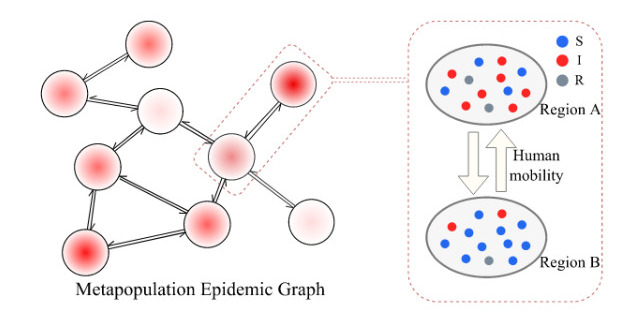

## Epidemic dynamics on metapopulation networks
 
Metapopulation models have been a powerful tool for both theorizing and simulating ``epidemic dynamics``. In
a metapopulation model, one considers a network composed of subpopulations and their pairwise connections,
and individuals are assumed to migrate from one subpopulation to another obeying a given mobility rule. While
how different mobility rules affect epidemic dynamics in metapopulation models has been studied, there have been
relatively few efforts on comparison of the effects of simple (i.e., unbiased) random walks and more complex
mobility rules. 

A metapopulation model assumes that a population of individuals is distributed over subpopulations, which correspond to the geographical locations, such as local gathering places, cities, or counties. On the microscopic scale, the individuals are assumed to be fully mixed within each subpopulation. An infectious individual infects each susceptible individual in the same subpopulation with the same rate/probability. This assumption is practical in the absence of detailed data on the structure of interactions among the individuals within each subpopulation. On the macroscopic scale, the individuals traverse edges in the network to travel from one subpopulation to another according to a mobility rule.

In order to understand the geographical diffusion of diseases, one has to combine the microscopic contagion processes with the long-range disease propagation due to human mobility across different spatial scales. In order to tackle this problem, epidemic modeling has relied on reaction-diffusion dynamics in ``metapopulations``. Metapopulations can be thought as nodes of a complex network of spatial patches, where links encode human flows from one place to another and are responsible for between-patch transmission.

## Metapopulation SIR model - Considering flows of people between populations

